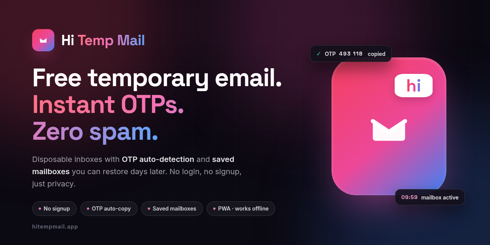

<div align="center">



# Hi Temp Mail

**Free temporary email. Instant OTPs. Zero spam.**

A privacy-first disposable email web app. A real, working inbox is generated the moment you
arrive — catch OTP codes, keep the spam out, and walk away when you're done.
**No login. No signup. No tracking.**

[](https://nextjs.org)
[](https://react.dev)
[](https://www.typescriptlang.org)
[]#-pwa--offline-first
[]LICENSE

[Live demo](https://hitempmail.app) · [Features](#-features) · [Getting started](#-getting-started) · [Deploy](#-deployment) · [FAQ](http://hitempmail.app/faq.html)

</div>

---

## ✨ Features

| | Feature | Description |
|---|---|---|
| ⚡ | **Instant inbox** | A secure disposable mailbox is minted the moment the app opens — zero forms, zero friction. |
| 🔐 | **OTP auto-detection** | 4–8 digit verification codes are detected automatically and offered as a one-tap copy chip (optional auto-copy). |
| 🔖 | **Saved Mailboxes vault** | Keep any address and restore it days later — the same mailbox keeps receiving mail, OTPs included. |
| ⏱️ | **10-minute lifetime + Extend** | Self-destruct timer with a one-tap extend when you need a little longer. |
| 📎 | **Attachments** | View and download email attachments safely. |
| 🛡️ | **Privacy by design** | Privacy blur, remote-image (tracking pixel) blocking, and fully sanitized email HTML — scripts and trackers never run. |
| 🔎 | **Power inbox** | Search, pull-to-refresh, sound & vibration alerts, mark-all-read. |
| 💾 | **Backup & restore** | Export / import your saved mailboxes as a file — works across devices. |
| 🌗 | **Light & dark themes** | A hand-tuned rose → pink → blue design system, beautiful in both modes. |
| 📱 | **Installable PWA** | Install to your home screen, use it offline, launch it like a native app. |

## 🧑‍💻 How it works

1. **Open the app** — a working mailbox is generated instantly (no account needed).
2. **Copy the address** — paste it into any signup, trial or verification form.
3. **Grab your code** — incoming OTPs are detected automatically with a one-tap copy chip.
4. **(Optional) Save the mailbox** — restore the exact same address later and keep receiving mail.

## 🏗️ Architecture & tech stack

| Layer | Technology |
|---|---|
| Framework | **Next.js 16** (App Router, Turbopack) + **React 19** + **TypeScript 5** |
| UI | **Tailwind CSS 4**, custom rose→pink→blue design system, Material Symbols |
| App engine | Zero-dependency single-file app (`index.html` → served as `public/ar-tempmail.html`), rendered in an iframe |
| Orchestration | `src/app/page.tsx` shell — landing ⇄ app crossfade, postMessage protocol (`HI_TEMPMAIL_LAUNCH` / `HI_TEMPMAIL_HOME`), app stays mounted so the mailbox survives round-trips |
| Mail backend | [Mail.tm](https://mail.tm) free API — reached through a **same-origin relay** (`src/app/api/mailtm/[...path]/route.ts`) that transparently solves Mail.tm's CORS restriction. No API keys, no server database. |
| SEO / AI agents | JSON-LD (`WebSite`, `WebApplication`, `HowTo`, `FAQPage`), crawlable `<noscript>` content, `sitemap.xml`, `robots.txt`, `llms.txt` + `llms-full.txt` |

```text
hi-temp-mail/
├── index.html                        # App source (single file, dev master)
├── public/
│   ├── ar-tempmail.html              # The app as served (mirror of index.html)
│   ├── landing.html                  # Premium intro / landing experience
│   ├── about.html · faq.html · privacy.html · disclaimer.html
│   ├── sw.js                         # Service worker (PWA)
│   ├── offline.html                  # Branded offline fallback
│   ├── manifest.webmanifest          # PWA manifest
│   ├── robots.txt · sitemap.xml · llms.txt · llms-full.txt
│   └── favicon.svg · logo.svg · og-image.png · icon-*.png · apple-touch-icon.png
├── docs/
│   └── banner.png                    # GitHub README banner
└── src/
    ├── app/
    │   ├── layout.tsx                # SEO metadata, fonts, PWA wiring
    │   ├── page.tsx                  # Landing ⇄ app shell (iframe orchestration + JSON-LD)
    │   └── api/mailtm/[...path]/route.ts   # Same-origin Mail.tm relay
    └── components/
        └── service-worker-registrar.tsx    # Production-only SW registration
```

## 🏁 Getting started

**Prerequisites:** Node.js 20.9+ (or Bun 1.2+)

```bash
# 1. Clone
git clone https://github.com/<your-username>/hi-temp-mail.git
cd hi-temp-mail

# 2. Install
npm install        # or: bun install

# 3. Run
npm run dev        # or: bun run dev
# → http://localhost:3000
```

| Script | What it does |
|---|---|
| `npm run dev` | Start the dev server on port 3000 |
| `npm run build` | Production build (`next build`) |
| `npm run build:standalone` | Production build + standalone output for self-hosting |
| `npm start` | Serve the standalone build (`build:standalone` first) |
| `npm run lint` | ESLint |

> After editing the app (`index.html`), mirror it to the served copy: `cp index.html public/ar-tempmail.html`.

## 🚀 Deployment

### Vercel (recommended)

1. Push this repository to GitHub.
2. In Vercel, **Add New → Project → Import** the repo — Next.js is auto-detected, no build settings needed.
3. *(Optional)* set the env var `NEXT_PUBLIC_SITE_URL=https://your-domain.com` so canonical/OG tags use your domain.
4. Deploy. On the production domain the service worker activates and the app becomes installable.

### Self-hosting

```bash
npm run build:standalone
npm start          # serves on port 3000
```

## 📱 PWA — offline first

- **Installable** — install buttons appear automatically in browsers that allow it (Chrome, Edge, Android); on iOS use *Share → Add to Home Screen*.
- **Service worker** (`public/sw.js`) — precaches the app shell, landing page and static assets; navigations are network-first with cache + branded offline fallback; static assets use stale-while-revalidate.
- **Mail is never cached** — requests to `/api/*` (the Mail.tm relay) always hit the network, so your inbox is never served stale.
- **`launch_handler: focus-existing`** — reopening the installed app focuses your existing session, keeping the live mailbox alive.

## 🔐 Privacy

- **No server database.** The app runs entirely in your browser; messages are stored by the Mail.tm service.
- **No analytics, no ads, no tracking.**
- Only browser-local storage is used:

| Key | Purpose |
|---|---|
| `theme` | Light/dark preference |
| `ar_saved_mails` | Your saved-mailbox vault (address + password) |
| `ar_active_session` | Current mailbox session |
| `ar_settings` | App settings (alerts, auto-copy, privacy blur) |

Clearing your browser's site data wipes every local trace.

## ⚠️ Disclaimer

Disposable addresses are for **low-risk signups only** — trials, downloads, forums, Wi-Fi portals.
Never use one for banking, government, health or any account whose loss would harm you.
See the full [Disclaimer](http://hitempmail.app/disclaimer.html) and [Privacy Policy](http://hitempmail.app/privacy.html).

## 🎨 Brand assets

| Asset | File | Size |
|---|---|---|
| Open Graph image | `public/og-image.png` | 1200×630 |
| GitHub banner | `docs/banner.png` | 1280×640 |
| App icons | `public/icon-192.png` / `public/icon-512.png` | 192², 512² |
| Maskable icons (Android adaptive) | `public/icon-maskable-192.png` / `public/icon-maskable-512.png` | 192², 512² |
| Apple touch icon | `public/apple-touch-icon.png` | 180² |
| Vector marks | `public/favicon.svg` / `public/logo.svg` | scalable |

## 📄 License

Released under the [MIT License](LICENSE) — free to use, modify and self-host.

<div align="center">
<sub>Say hi to email that leaves no trace. 💌</sub>
</div>
